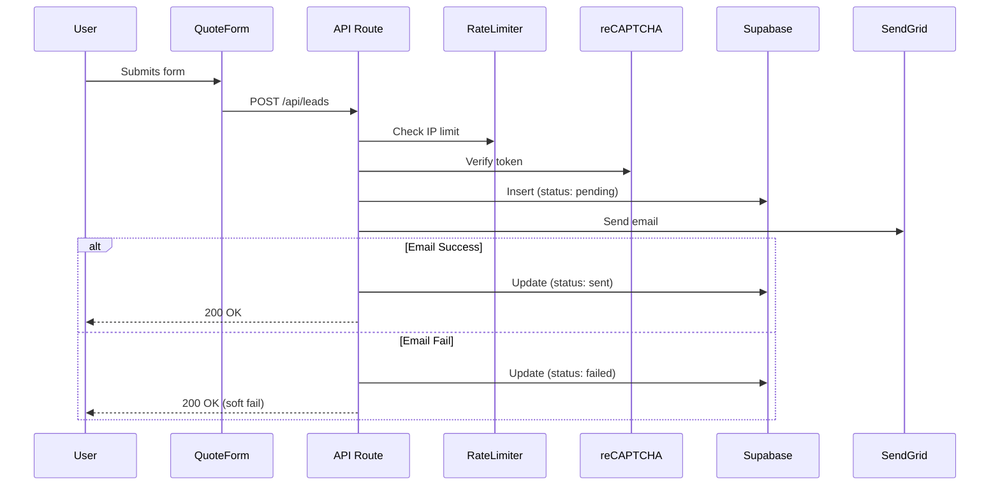
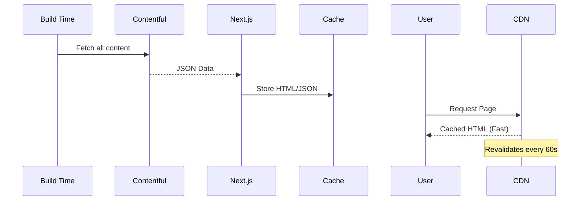

# System Architecture

## Overview
GoGo Imperial Energy is a Next.js 14 web application designed for performance, SEO, and reliability. It uses a hybrid rendering approach (ISR for content, Client Components for interactivity) and integrates with headless services for content and data.

## Tech Stack

| Component | Technology | Role |
|-----------|------------|------|
| **Frontend** | Next.js 14 (App Router) | React framework, SSR/ISR |
| **Language** | TypeScript | Type safety |
| **Styling** | Tailwind CSS v4 | Utility-first styling |
| **CMS** | Contentful | Headless content management |
| **Database** | Supabase (PostgreSQL) | Lead persistence |
| **Email** | SendGrid | Transactional emails |
| **Security** | reCAPTCHA v3 | Bot protection |
| **Hosting** | Vercel | Edge network deployment |

## Data Flow

### 1. Lead Submission Flow

### 2. Content Fetching (ISR)

## Directory Structure

- `src/app`: Page routes and API endpoints
- `src/components`: Reusable UI components
- `src/lib`: Service clients (Supabase, SendGrid, CMS)
- `src/context`: React contexts (Language)
- `docs`: Developer documentation

## Security Measures

- **CSP**: Strict Content-Security-Policy headers
- **Rate Limiting**: LRU-based IP tracking
- **Input Validation**: Zod schemas for all API inputs
- **Honeypot**: Hidden fields to trap bots
- **Secrets**: Environment variables (never committed)

## Performance Optimizations

- **Images**: `next/image` with WebP/AVIF
- **Fonts**: `next/font` (DM Sans)
- **Scripts**: Third-party scripts (GTM, Pixel) lazy loaded
- **Content**: ISR caching with 60s revalidation

## Deployment Pipeline

1. **Commit** -> GitHub Main
2. **CI Check** (GitHub Actions): Lint, Type Check, Build, Test, Lighthouse
3. **Deploy** -> Vercel Production
