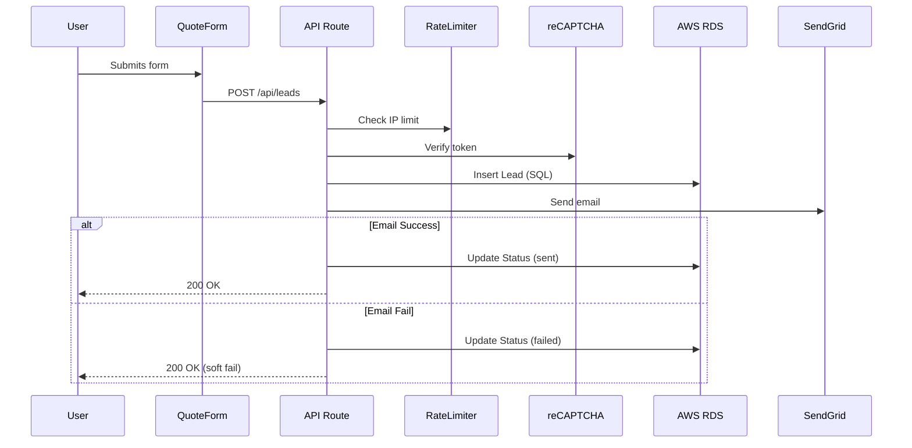
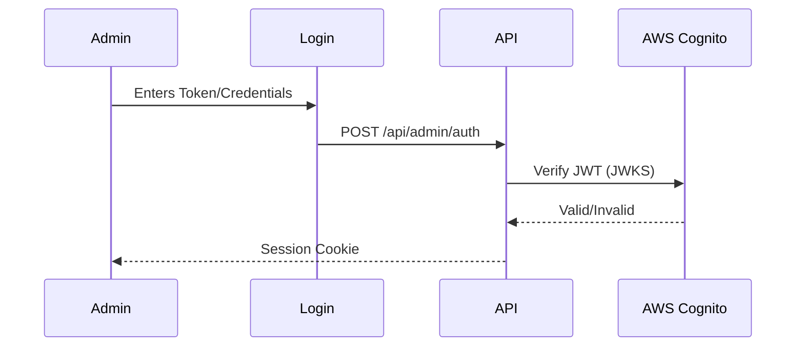

# System Architecture

## Overview
GoGo Imperial Energy is a Next.js 16 web application designed for performance, SEO, and reliability. It uses a hybrid rendering approach and integrates with AWS Native services for scalar and secure operations.

## Tech Stack

| Component | Technology | Role |
|-----------|------------|------|
| **Frontend** | Next.js 16 (App Router) | React framework, SSR/ISR |
| **Language** | TypeScript | Type safety |
| **Styling** | Tailwind CSS v4 | Utility-first styling |
| **CMS** | Contentful | Headless content management |
| **Database** | **AWS RDS (PostgreSQL)** | Persistent data (Leads, etc.) |
| **Storage** | **AWS S3** | File & Media storage |
| **Auth** | **AWS Cognito** | Admin authentication (JWT) |
| **Hosting** | **AWS Amplify** | Full-stack deployment |

## Data Flow

### 1. Lead Submission Flow

### 2. Admin Authentication

## Directory Structure

- `src/app`: Page routes and API endpoints
- `src/components`: Reusable UI components
- `src/lib`: Service clients (DB, S3, Cognito, CMS)
- `src/context`: React contexts (Language)
- `docs`: Developer documentation

## Security Measures

- **CSP**: Strict Content-Security-Policy headers
- **Rate Limiting**: LRU-based IP tracking
- **Input Validation**: Zod schemas for all API inputs
- **Honeypot**: Hidden fields to trap bots
- **Secrets**: Environment variables (AWS Amplify Console)

## Deployment Pipeline

1. **Commit** -> GitHub Main
2. **Amplify Build**: `npm run build`
3. **Deploy**: AWS Amplify Hosting
